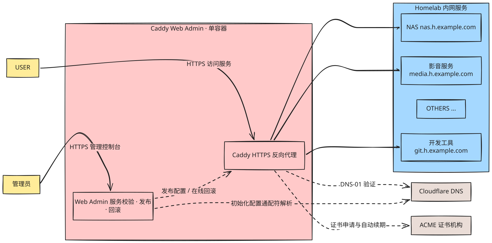
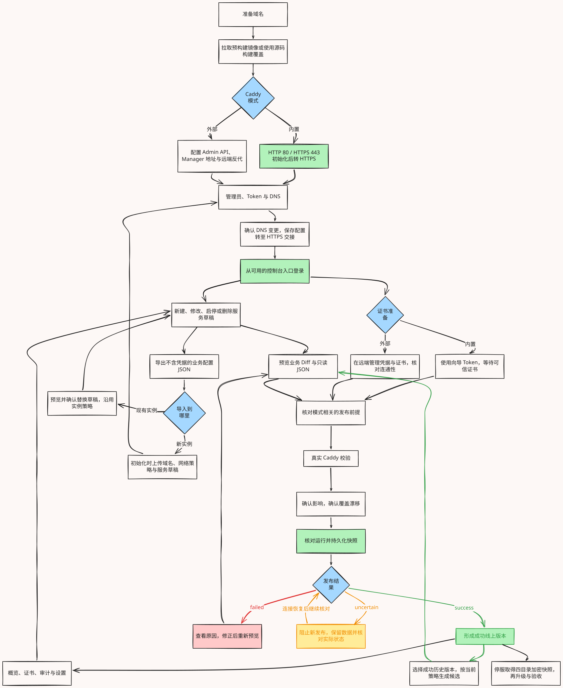

# 🔑 Caddy Web Admin

> Caddy 反向代理控制台，用于个人 Homelab、小型内网或单管理员的自托管环境。

### 用单容器完成内网所有服务的 https 配置和管理，为 NAS、影音、开发工具等服务提供统一域名和 HTTPS 入口。

## 一个🌰


实线表示访问流量，虚线表示配置、解析或证书管理。域名解析到 Caddy 的入口 IP，由 Caddy 转发到对应的内网服务。

## 快速部署

需要 Docker Compose 和可用域名。Setup 与登录页默认不限制公网/内网来源；管理操作需要管理员认证。

```bash
mkdir -p caddy-admin
cd caddy-admin
curl -fsSL https://raw.githubusercontent.com/gofxq/caddy_admin/HEAD/compose.yaml -o compose.yaml
docker compose up -d
```

或者从这里复制 [compose.yaml](compose.yaml)。

打开 `http://服务器IP/setup`，按向导创建管理员、填写 Cloudflare Token 并确认 DNS 变更，自动配置通配符解析与申请证书。HTTP 会明文传输手动填写的密码与 Token，建议从 HTTPS 打开；完成后切换 HTTPS，签发期间可能出现临时证书提示。数据默认保存在 `.run/`，可在 Compose 的 `volumes` 中[自定义数据目录](docs/operations.md#持久化)。

默认使用 `ghcr.io/gofxq/caddy-admin:latest`，无需 clone 源码或本地构建。

## 完整流程


保存草稿不会影响线上，确认发布后才生效。

可选：在 Compose 的 `environment` 中填写 `ADMIN_PASSWORD`、`CLOUDFLARE_API_TOKEN`，或通过环境变量/`.env` 注入；Setup 只确认使用，不回显。初始化后环境密码不重置账号，持久化 Token 优先。字面 `$` 在 Compose YAML 中写 `$$`；不要将真实凭据提交到版本控制。详见[凭据预配置](docs/operations.md#凭据预配置)。

首次登录后在设置中配置域名访问范围和上游许可，再添加服务、预览、校验与确认发布。控制台 LAN/VPN 限制为登录后的可选项。

## 功能演示

想先体验功能，可运行 `make static-web`，打开 `http://127.0.0.1:5178`。这是无需后端的纯静态演示，配置、DNS、证书和发布均在浏览器中模拟成功；也可部署到 Vercel，详见[静态 Demo](docs/demo.md)。

## 技术栈

- 后端：Go、Gin、GORM、SQLite。
- 前端：React、TypeScript、Vite、Tailwind CSS。
- 代理与证书：Caddy、Cloudflare DNS 模块。
- 构建与部署：Docker Compose、GitHub Actions、GHCR。

## 文档

- [使用指南](docs/usage.md) · [完整流程与汇总图](docs/product-user-flow-review.md)：服务管理、发布、回滚和配置导入导出。
- [部署与维护](docs/operations.md)：DNS、完整配置、源码构建、外部 Caddy、升级与备份。
- [从零测试](docs/testing.md) · [验证边界](docs/verification.md) · [API](docs/api.md)。
- [开发与贡献](CONTRIBUTING.md) · [安全报告](SECURITY.md) · [变更记录](CHANGELOG.md)。

[Apache-2.0](LICENSE)
