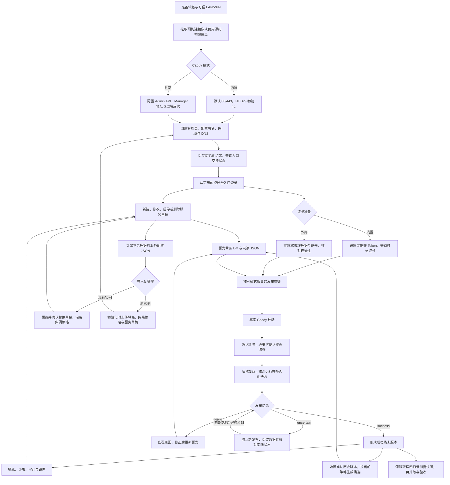
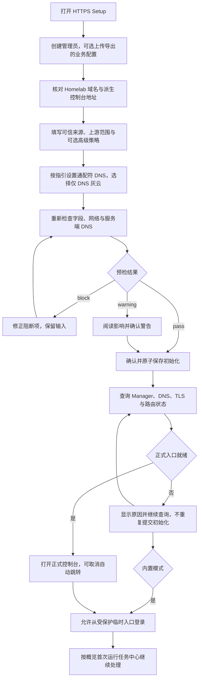
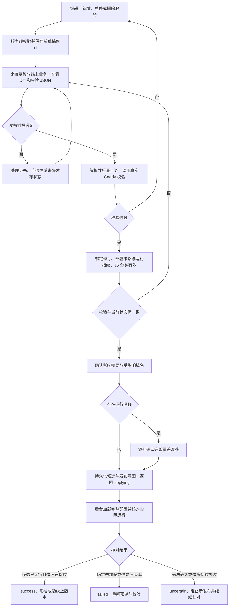
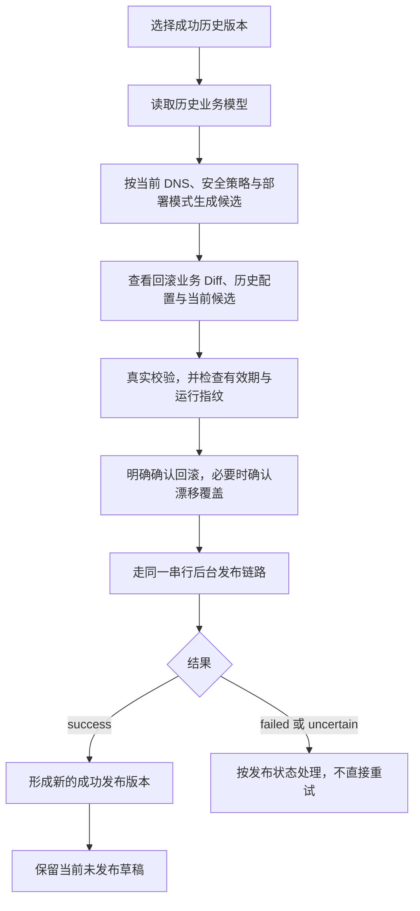
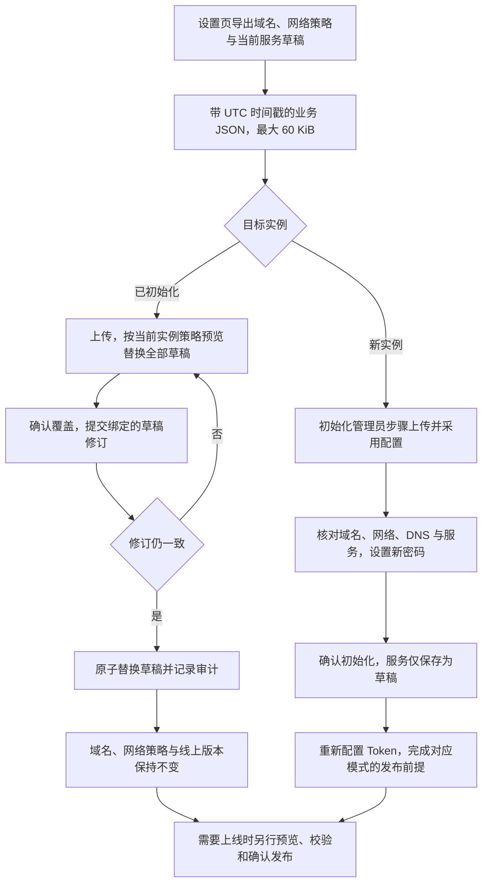

# 产品完整使用流程

更新于 2026-10-02

本文描述已实现的流程；真实浏览器、DNS、证书签发和目标网络仍按[验证边界](verification.md)验收。

## 汇总图

草稿可以在等待证书期间保存，只有发布会改变线上。现有实例导入不改变域名、网络策略或线上版本；回滚也需要重新校验与确认。汇总图中的证书准备按模式处理：内置模式有服务端可信证书门禁，外部模式的证书与凭据由远端负责。

## 部署与首次初始化

| 场景         | 当前入口与职责                                                                                                                      |
| ------------ | ----------------------------------------------------------------------------------------------------------------------------------- |
| 默认内置模式 | `compose.yaml` 拉取 `ghcr.io/gofxq/caddy-admin:latest`；打开 `https://服务器IP/setup`，80 仅跳转 HTTPS                              |
| 本地源码构建 | 追加 `compose.build.yaml`，使用独立的 `caddy-admin:local` 标签                                                                      |
| 外部 Caddy   | 追加 `compose.external.yaml`，配置 `CADDY_ADMIN_URL`、`MANAGER_DIAL`；查询 8082 的实际 HTTPS Setup 映射，宿主 80/443 留给远端 Caddy |
| 隔离验证     | 构建当前源码，使用 `compose.validation.yaml` 的随机回环端口和独立测试卷，不读取真实 `.run/`                                         |

默认内置模式没有随机 Setup 端口。第一次安装不需要提前填写密码、Token 或 `.env`；管理员密码通过 HTTPS 向导设置。第一个有效提交创建唯一管理员，初始化前须将入口限制在可信 LAN/VPN。

DNS 步骤只生成记录指引，不自动修改 Cloudflare。内置模式从当前访问的私网 IP 提供建议；localhost 或外部模式需手工填写实际 Caddy 地址。重新检查只证明服务端能解析控制台域名，不证明记录指向建议 IP、用户设备可达或 TLS 就绪。

初始化默认只配置 Homelab，控制台地址为 `https://caddyadmin.<Homelab域名>`。Public 域名初始为空，当前没有界面配置入口。服务列表默认为空，显式初始化导入除外。

Setup 提交后持续查询交接状态，正式入口就绪才开始可取消的跳转倒计时。内置模式可通过受 LAN、认证、Origin 与 CSRF 保护的临时入口继续登录；外部交接入口只提供静态页面和只读状态。浏览器读到正式入口就绪后，临时入口保留五分钟再关闭。

外部模式须预先准备控制台反代、Admin API 访问边界和远端 DNS 凭据；Setup 不会自动发布到远端实例，外部不可达也不会回退到内置 Caddy。

## 证书准备与日常发布

概览的首次运行任务中心已经按模式展示正式入口、证书或外部连通性、草稿和首次成功发布的状态。内置模式在设置页提交 Token，文件默认位于 `${DATA_DIR}/secrets/cloudflare_token`；只暴露配置状态，不回显凭据。

内置模式须完成 Cloudflare 激活、运行配置核对和真实可信 TLS 探测，才能校验或发布服务；`TEST_TLS=true` 不能绕过该门禁。证书探测失败显示未知，内部测试 CA 不显示为公网可信。外部模式由远端管理证书，Manager 本地校验不证明远端模块、Token、存储或证书可用。

新增、修改、启停和删除只改草稿；删除确认会说明原路由在再次发布前仍在线上。当前服务表单仍输入完整的一层子域，上游受网段、显式服务名和受保护目标规则限制；HTTPS 上游必须校验证书。

发布确认框已展示新增、修改、启用、停用、删除的数量，以及受影响域名和漂移覆盖确认。当前任务卡追踪任务 ID，显示后台执行状态；关闭页面不会取消发布，`202` 只表示任务已接收。

| 状态        | 含义与下一步                                                                         |
| ----------- | ------------------------------------------------------------------------------------ |
| `applying`  | 正在后台执行，等待核对；不能并行提交另一发布                                         |
| `success`   | 候选已运行且启动快照已持久化，可继续管理或在线回滚                                   |
| `failed`    | 已明确未加载或未完成替换；刷新预览、修正原因并重新校验                               |
| `uncertain` | 实际状态无法确定，或已加载但快照保存未完成；保留数据、恢复连通性并核对，不能重复发布 |

幂等标识用于同一请求的重试，不能用于绕过未决状态或更换请求内容。断联、响应丢失或 Manager 重启后，系统读取实际运行配置继续核对；仍存在未知配置或持久化问题时，应按运维文档诊断，不能手工写快照来判定成功。

## 在线回滚

回滚重新发布历史业务模型，不直接加载历史 JSON。历史业务不符合当前策略或 DNS 校验时不能继续；只有成功版本可作为回滚目标。回滚后的线上配置与保留的草稿可能不同，用户仍须明确决定下一次发布的内容。

## 配置导入导出

空服务列表经确认后会清空现有草稿；文件无效或修订冲突不会部分覆盖。新实例导入只接受当前初始化支持的 Homelab、标准控制台地址与业务模型，不支持 Public 域名、自定义控制台标签或 Origin 端口。

导出没有密码、会话、Token、证书、发布历史、内部服务 ID 或解析地址快照；它包含内网地址等业务信息，应妥善保存，不能代替完整备份。

## 数据维护与当前边界

| 操作       | 当前做法                                                                                             |
| ---------- | ---------------------------------------------------------------------------------------------------- |
| 日常运行   | SQLite 保存草稿、修订、发布与审计；内置 Caddy 使用 `.run/snapshots/active.json` 启动，正常发布热加载 |
| 密码修改   | 设置页修改后撤销旧会话；CLI 重置须先停止 Manager，密码通过维护终端输入                               |
| 升级与保护 | 停服取得 Manager、快照、Caddy 数据与配置四目录的一致加密快照；外部 Caddy 数据另行保护                |
| 故障恢复   | 控制台可用时优先回滚成功版本；否则保留数据，在隔离副本诊断或恢复已验证的宿主快照                     |

当前只支持空库或完整的当前 v6 数据库，没有旧设置、旧目录、旧 CLI 的兼容入口，也没有项目级备份、恢复或离线救援命令。业务配置导入、在线回滚和宿主快照分别解决不同问题，不能相互替代。

已实现的交互包括分步预检、DNS 记录复制与重新检查、可恢复交接、首次运行任务中心、发布四态任务卡和影响摘要。尚未提供多用户、多实例、多上游、路径路由、主动上游健康检查、流量图表或任意配置编辑器；Public 域名运行时配置也仍未提供。

下一步主要是实际环境验收：浏览器与移动端、真实 DNS/Cloudflare 签发和续期、目标防火墙/NAT/LAN/VPN，以及加密宿主快照的隔离恢复演练。自动测试和演示界面不能替代这些验收。

## 对照入口

- [快速部署](../README.md#快速部署)、[使用指南](usage.md)、[部署与维护](operations.md)。
- [API 与发布协议](api.md#发布协议)、[从零测试](testing.md)、[验证边界](verification.md)、[当前待办](roadmap.md)。
- 实现：[Setup](../web/src/pages/Setup.tsx)、[首次运行任务](../web/src/pages/Overview.tsx)、[发布页面](../web/src/pages/Deployments.tsx)、[发布与核对](../internal/application/deploy.go)、[配置导入导出](../internal/application/configuration.go)。
